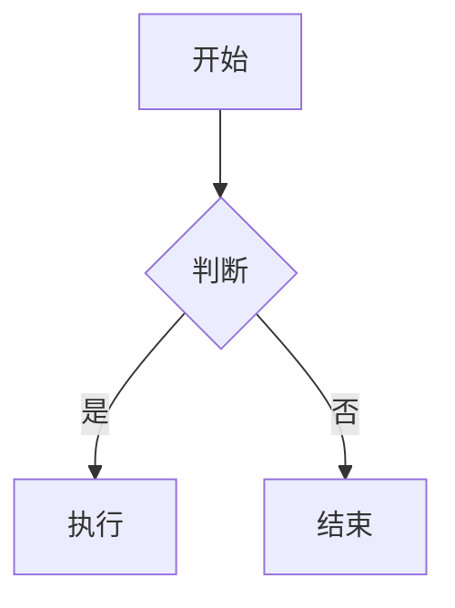
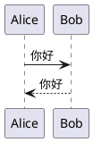

# Markdown 语法标注大全

> 本文档汇总了 Markdown 中几乎所有可用的标注（标记语法）。
> 说明：部分语法为扩展功能，需对应渲染器支持（见文末对照表）。

[TOC]

---

## 一、标题

# 一级标题
## 二级标题
### 三级标题
#### 四级标题
##### 五级标题
###### 六级标题

Setext 风格（仅 1、2 级）：

一级标题
=======

二级标题
-------

带自定义 ID（部分渲染器）：

### 带 ID 的标题 {#custom-id}

---

## 二、强调与文字样式

- *斜体*：`*斜体*` 或 `_斜体_`
- **加粗**：`**加粗**` 或 `__加粗__`
- ***粗斜体***：`***粗斜体***`
- ~~删除线~~：`~~删除线~~`
- ==高亮==：`==高亮==`（扩展）
- `行内代码`：`` `行内代码` ``
- 下标：H<sub>2</sub>O → `<sub>`
- 上标：x<sup>2</sup> → `<sup>`
- 下划线：<ins>下划线</ins> → `<ins>`
- 标记：<mark>标记</mark> → `<mark>`

---

## 三、列表

无序列表（`-` / `*` / `+`）：

- 项目一
- 项目二
- 项目三

有序列表：

1. 第一项
2. 第二项
3. 第三项

嵌套列表：

- 一级
  - 二级
    - 三级
1. 有序一级
   1. 有序二级

任务列表（GFM）：

- [x] 已完成任务
- [ ] 未完成任务

定义列表（扩展）：

术语
: 术语的定义内容

---

## 四、链接与图片

- 行内链接：[示例站点](https://example.com)
- 带标题：[示例站点](https://example.com "悬停标题")
- 相对链接：[本目录文档](./README.md)
- 锚点跳转：[跳转到标题](#一标题)
- 邮箱链接：[发送邮件](mailto:test@example.com)
- 自动链接：https://example.com
- 尖括号自动链接：<https://example.com>

图片：


参考式链接与图片：

这是一个[参考式链接][ref]，这是参考式图片 ![][imgref]。

[ref]: https://example.com "参考式链接标题"
[imgref]: https://via.placeholder.com/100 "参考式图片"

---

## 五、代码

行内代码：使用 `print("hello")` 输出。

含反引号的行内代码：`` 这里有 ` 反引号 ``

围栏代码块（指定语言）：

```python
def hello(name):
    print(f"Hello, {name}!")
```

以波浪线作为围栏：

~~~javascript
console.log("hello");
~~~

缩进代码块（4 个空格或 1 个 Tab）：

    print("缩进式代码块")

---

## 六、引用块

> 这是一段引用。
> 可以写成多行。

> 第一层
>> 第二层嵌套
>>> 第三层嵌套

GFM 告警块（GitHub 支持）：

> [!NOTE]
> 提示信息。

> [!TIP]
> 建议信息。

> [!IMPORTANT]
> 重要信息。

> [!WARNING]
> 警告信息。

> [!CAUTION]
> 危险信息。

---

## 七、表格

| 左对齐 | 居中 | 右对齐 |
|:-------|:----:|-------:|
| A      | B    | C      |
| 内容1  | 内容2 | 内容3 |
| `code` | **粗** | *斜* |

---

## 八、分隔线

---

***

___

- - -

* * *

---

## 九、转义与特殊字符

- 转义星号：\*
- 转义下划线：\_
- 转义井号：\#
- 转义反引号：\`
- 转义方括号：\[ \]

HTML 实体：

- 空格：A&nbsp;&nbsp;&nbsp;B
- `&amp;` → &amp;
- `&lt;` → &lt;
- `&gt;` → &gt;
- `&copy;` → &copy;
- 数字实体：&#128512; &#169;

---

## 十、注释与元数据

HTML 注释（渲染时不显示）：

<!-- 这是一段注释 -->

YAML Front Matter 见本文档顶部：

```yaml
---
title: 文档标题
author: 作者
tags: [a, b]
---
```

TOML Front Matter：

```toml
+++
title = "标题"
+++
```

---

## 十一、脚注（扩展）

这是正文中的脚注引用[^1]，这是另一个[^note]。

[^1]: 这是第一个脚注的内容。
[^note]: 带命名标识的脚注内容。

行内脚注（Pandoc）：正文^[这是行内脚注]。

---

## 十二、数学公式（LaTeX，扩展）

行内公式：$E = mc^2$，质能方程。

块级公式：

$$
\int_a^b f(x)\,dx = F(b) - F(a)
$$

---

## 十三、图表（扩展）

Mermaid 流程图：



PlantUML 时序图：



---

## 十四、目录与内联 HTML

目录标注：

- `[TOC]`（部分工具）
- `[[_TOC_]]`（Azure DevOps 等）

内联 HTML：

<div align="center">这段文字居中显示</div>

<br/>


---

## 十五、嵌入 / 引用其他文件（扩展）

```markdown
![[嵌入的笔记或图片]]        Obsidian 嵌入
!INCLUDE "file.md"           Pandoc 包含
{{ include: file.md }}       某些工具语法
```

---

## 十六、MDX 特有标注（.mdx）

```mdx
import Button from './Button'

# 标题

<Button>点击我</Button>

{1 + 1}
```

---

## 十七、Wiki 链接（Obsidian / 部分工具）

```markdown
[[另一篇笔记]]
[[另一篇笔记|显示文字]]
[[另一篇笔记#标题]]
```

---

## 十八、各类方言支持对照表

| 语法 | CommonMark | GFM | Pandoc | Obsidian/Typora |
|------|:---:|:---:|:---:|:---:|
| 基础强调/标题/列表 | ✅ | ✅ | ✅ | ✅ |
| 表格 | ❌ | ✅ | ✅ | ✅ |
| 任务列表 | ❌ | ✅ | ✅ | ✅ |
| 删除线 | ❌ | ✅ | ✅ | ✅ |
| 脚注 | ❌ | ❌ | ✅ | ✅ |
| 数学公式 | ❌ | ✅ | ✅ | ✅ |
| Mermaid | ❌ | ✅ | ✅ | ✅ |
| Front Matter | ❌ | ❌ | ✅ | ✅ |
| 定义列表 | ❌ | ❌ | ✅ | 部分 |
| 高亮 `==` | ❌ | ❌ | ✅ | ✅ |
| 告警块 | ❌ | ✅ | ❌ | 部分 |
| Wiki 链接 `[[]]` | ❌ | ❌ | ❌ | ✅ |
| 嵌入 `![[]]` | ❌ | ❌ | ❌ | ✅ |

---

## 十九、文件扩展名

| 扩展名 | 说明 |
|--------|------|
| `.md` | 最常见 |
| `.markdown` | 全称 |
| `.mdown` / `.mkd` / `.mkdn` | 变体 |
| `.mdx` | 可嵌入 JSX |

---

## 二十、小结

Markdown 标注可归纳为六大类：

1. **块级元素**：标题、段落、列表、引用、代码块、表格、分隔线、Front Matter
2. **行内元素**：强调、代码、链接、图片、脚注、公式、HTML 标签
3. **扩展元素**：任务列表、告警块、定义列表、脚注、图表、目录
4. **元数据**：YAML / TOML Front Matter
5. **转义**：反斜杠转义、HTML 实体
6. **内联 HTML**：任意 HTML 标签

> 提示：不同渲染器（GitHub、Typora、Obsidian、VS Code 等）对扩展语法支持不同，请以实际渲染效果为准。