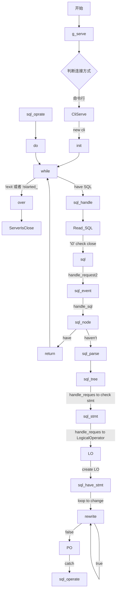

# java
# 面向对象
## 变量
### 静态变量
- 具体参考2026_09_11的java变量的定义
- 对于静态变量来说，jvm(java虚拟机)只会分配一次内存
### 非静态变量
- 和普通的变量就无差别了
## 方法
```java
[修饰符]<方法返回值的类型><方法名>([参数列表]){}
```
- 修饰符可选于c++相同
- 返回类型**必须写**用于方法的返回类型
- 方法名**必须写**
- 参数列表，可以无参
## 构造方法
- 和c++一样，这里就不多赘述
## main方法
- 是java程序的运行入口，等价于c/c++的main
- java的main所在的对象的对象名应于外部的.java一致
## 创建对象
```java
类名 对象名
```
>c++一样
## 使用对象内部方法
- 和c++一样通过 **.** 即可
## 销毁
- java使用GC进行内存的自动管理
- GC:即创建一个独立线程管理资源
> 在c和c++(98)之前资源是手动管理的，自c++98后就使用了RAII,在c++11引入了std::unique_ptr / std::shared_ptr、std::lock_guard等更多的智能指针标准库，实现从手动管理到了有生命周期的自动管理创建的内存
### 终止器(finalize)
- 类似于c++的析构函数，用于被delete掉时的处理关联的对象函数变量
- 当finalize并不会马上的回收内存，需要等待GC来释放，因此这个时间是不可预测的
## this
- 和c++的this指针一样
- 用来自指方法/变量
- 其和普通的对象调用一样，只不过是在其自己的内部
## static
- 静态资源修饰符
- 其不依赖于任何一个对象
>c++的static一样
## 内存分析
- 之前我们知道他是GC回收，但其仍然有他字的内存空间分布
>其余与c++一样
- 当string对象使用=时会创建一个指向内存区的引用即浅拷贝
# 包
- 可以对比为rust的路径的概念
## 创建包
```java
package 包名
```
- 可以是用*.java去编译某个目录下的所有java源文件
## 使用
- 和rust的路径相似
```java
import 路径.包名
```
# 包装类
- 为每个基本类都提供了包装类
- JDK1.5开始可以实现自动的"装箱""拆箱"
# 内部类
- 即java的嵌套类
- 使用内部类，可以对其进行影藏细节
# 匿名类
- 和c++lamba表达式类似，用于不行函数名，或者缺省的写一个简单的函数
# 继承
## 概念
- 让一个类(子类)获取另一个类(父类)的属性和方法
- 提高代码的复用性,不用重复写相同的成员
> 和c++的继承一样
> 但和rust不同,rust**没有继承**,它靠 trait(特征)+组合 来实现复用与多态
## 语法
```java
[修饰符] class <子类名> extends <父类名> {
    //your code
}
```
- 使用 **extends** 关键字
- java**只允许单继承**,一个类只能有一个直接父类
> 不要像c++那样一次性继承两个类
## 父类和子类
- 子类 is-a 父类(子类"是一种"父类)
- 子类会拥有父类所有**非私有**的成员(变量和方法)
- 子类 **不能** 访问父类的 private 成员
> 具体权限参考2026_09_11的[修饰符]
> rust里没有父类子类这一说,想要复用就是把父类作为一个字段塞进去(组合),而不是继承
## 访问权限
|  修饰符名   |         权限         |
| :---------: | :------------------: |
|   public    |       任何类可访问       |
|  protected  |       同包+子类          |
|    (默认)    |       同包可访问         |
|   private   |       仅本类内部         |
- 子类能否继承该成员,就看它是不是 private
## super
- 指向父类的一个引用,用于在子类中自指父类
> 类似this,只不过this指自己,super指父类
> rust里也有super,但含义完全不同:它是**模块路径**语法,`super::` 表示上一级模块(类似文件系统的 `..`),和继承无关
> 组合结构里想复用父类的行为,就用 **self.字段.方法()** 去调
- 调用父类的变量/方法
```java
super.父类方法名();
```
- 调用父类的构造方法
```java
super(参数列表);
```
## 构造方法
- 子类的构造方法会**默认**在第一行调用父类的无参构造方法,即隐式写了一句 **super();**
- 如果父类没有无参构造方法,子类就**必须**显示写 **super(参数)** 来调用有参构造
> 和c++初始化列表里对父类的构造一个道理
- **super()** 必须是子类构造方法里的**第一条语句**
## 方法重写(override)
- 子类把父类的方法**重新定义**一遍
- 要求:方法名、参数列表、返回类型都相同
  > 返回类型允许是父类的子类(协变返回类型)
- 建议加上 **@Override** 注解,让编译器帮忙检查
> rust里没有重写,它是靠 **impl Trait for Type** 去实现特征(具体见trait那一节)
## 重写和重载
|   名称   |              条件              |
| :------: | :--------------------------: |
| 重写      | 子类和父类之间,方法名+参数相同   |
| 重载      | 同一个类内,方法名相同但参数不同   |
## final和继承
- **final** 修饰的类不能被继承
- **final** 修饰的方法不能被重写
## 密封类(sealed)
- java17+ 用 **sealed** 限定哪些类可以继承它
- 子类必须用 **final**、**sealed** 或 **non-sealed** 三者之一来声明
> 参考2026_09_11的[修饰符]
## this和super
|  关键字  |        指向        |
| :------: | :---------------: |
|   this   |    当前对象自己     |
|   super  |    当前对象的父类   |
- 两者都不能在 static 方法中使用
# 多态
## 概念
- 同一个调用,根据不同对象的实际类型,执行不同的行为
- 编译时看**引用类型**(父类),运行时看**实际对象**(子类)
> 即c++的虚函数那套:编译期看类型,运行期看对象
> rust里没有继承的多态,它对应的是 **dyn Trait**(动态分发)或泛型(静态分发)
## 实现条件
- 要有继承
- 要有方法重写
- 父类引用 指向 子类对象(向上转型)
## 向上转型
- 父类引用 指向 子类对象,是**自动**的
```java
父类 引用名 = new 子类();
```
## 向下转型
- 把父类引用 转回 子类,需要**强制**
```java
子类 引用名 = (子类) 父类引用;
```
- 转错了会抛 ClassCastException,一般先配合 instanceof 判断
## instanceof
- 判断一个对象是不是某个类/接口的实例
```java
if (对象 instanceof 类名) {
    //...
}
```
> java14+ 还有模式匹配写法: **对象 instanceof 类名 变量名**

# 抽象类
## 概念
- 用 **abstract** 修饰的类,不能被直接 new
- 可以理解为"半成品",只定义该有什么,不实现具体怎么做
> 即c++的**纯虚函数/抽象基类**
## 语法
```java
[修饰符] abstract class <类名> {
    //...
}
```
- 抽象类**可以**有成员变量、普通方法、构造方法
## 抽象方法
```java
[修饰符] abstract <返回类型> <方法名>([参数列表]);
```
- 用 **abstract** 修饰,**没有方法体**(只有分号)
- 抽象方法**必须**定义在抽象类里
- 子类**必须**重写父类的抽象方法,否则子类也必须是抽象类
> 对应c++的 **virtual ... = 0;**
## 特点
- 抽象类**不能**被实例化,只能被子类继承
- 抽象类可以继承抽象类
- final和abstract不能同时用(final不能被继承,abstract必须被继承)
> rust里没有抽象类,抽象方法对应的是trait里**没有默认实现**的方法

---
# 日常/miniob
- 在啃miniob
- 终于明白他是怎么走的了，大概吧


---