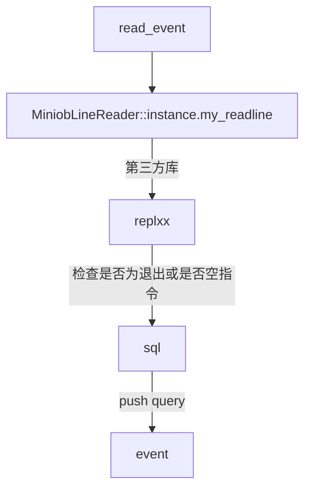

# java

# 数组

## 概念

- Java 数组是**对象**，分配在**堆上**，自带只读字段 `length`
- 长度创建后**固定**，想动态增删得用 `ArrayList`

```java
int[] a = new int[3];      // 元素默认 0，堆上分配
int[] b = {1, 2, 3};       // 静态初始化
int[][] m = new int[2][3]; // 数组的数组（锯齿数组，非连续二维块）
System.out.println(a.length);   // 3
a[0] = 10;
```

## 特点

- 长度固定，创建后不可变
- 越界抛 `ArrayIndexOutOfBoundsException`（每次访问都检查边界）
- 引用类型元素默认 `null`，基本类型有零值
- 数组**协变**：`Object[] o = new String[1];` 合法，写错类型运行期抛 `ArrayStoreException`
- 多维数组是"数组的数组"，每行长度可不同
  > c++ 的 `int a[3]`/`array<int,3>` 在栈上、`v[i]` 不检查边界（是 UB，只有 `at()` 抛异常），动态数组用 `vector<int>`；rust 的 `[i32;3]` 在栈上、长度是类型的一部分、越界直接 `panic`，动态数组用 `Vec<i32>`，安全取元素用 `get()` 拿 `Option`

# java类库

Java 标准库（JDK）按**包**组织，最常用的几个：

- `java.lang`：自动导入，`String`/`Object`/`Integer`/`Math`/`System`
- `java.util`：集合、日期、随机数、`Optional`
- `java.io`：传统流式 IO；`java.nio`：缓冲/通道/选择器、`Path`/`Files`
- `java.util.concurrent`：线程池、并发容器、`CompletableFuture`
- `java.time`：`LocalDate`/`Instant`/`Duration`；`java.net`：Socket、HTTP 客户端
  > 对应 rust 的 `std` 核心 + `std::collections` + `std::io`/`std::fs` + `std::thread`/`std::sync`；c++ 则是语言内建 + STL 容器/算法 + `<iostream>` + `<thread>`/`<mutex>`

## 集合

- `ArrayList` 动态数组、`LinkedList` 双向链表、`ArrayDeque` 双端队列（别用 `Stack`）
- `HashMap` 哈希表、`TreeMap` 红黑树有序表、`HashSet` 哈希集合
  > 分别对应 c++ 的 `vector`/`list`/`deque`/`unordered_map`/`map`/`unordered_set`
  > rust 的 `Vec`/`LinkedList`/`VecDeque`/`HashMap`/`BTreeMap`/`HashSet`

```java
import java.util.*;

Map<String, Integer> m = new HashMap<>();
m.put("a", 1);
m.getOrDefault("b", 0);          // 没有返回默认值，避免 null
m.computeIfAbsent("c", k -> 0);  // 惰性初始化

List<String> list = new ArrayList<>();
list.add("x");
for (String s : list) { System.out.println(s); }   // 增强 for

// 不可变集合（Java 9+）
List<Integer> fixed = List.of(1, 2, 3);
```

## 差异要点

- Java 集合**只装引用类型**，`List<int>` 不合法，得写 `List<Integer>` 并自动装箱（`Integer` 有 `-128~127` 缓存，比较要用 `equals` 而不是 `==`）
  > c++ 的 `vector<int>` 和 rust 的 `Vec<i32>` 都是真值类型，无装箱开销
- 遍历时改容器：Java fail-fast 抛 `ConcurrentModificationException`；c++ 迭代器失效；rust 借用检查**在编译期就禁止**
- `String` 不可变，拼接循环里用 `StringBuilder`（线程安全版是 `StringBuffer`，更慢）
  > c++ 的 `std::string` 可变；rust 的 `String` 可变（需 `mut`），`&str` 是不可变借用

```java
StringBuilder sb = new StringBuilder();
for (int i = 0; i < 100; i++) sb.append(i);
String s = sb.toString();          // 线程安全版本是 StringBuffer（带锁，更慢）
```

# 异常

## 概念

- 所有异常继承自 `Throwable`：`Error`（系统级，不该 catch）与 `Exception`
- `Exception` 又分**非受检** `RuntimeException`（NPE、越界、类型转换、算术）与**受检** checked（`IOException`、`SQLException`）
- 受检异常必须 `throws` 声明或 `try/catch`，编译器强制处理
  > c++ 没有任何强制、可抛任意类型（`throw 42;` 合法）
  > rust 没有异常，用 `Result<T, E>` 返回值表达，`panic!` 只用于不可恢复错误

```java
// 受检：调用者必须处理
public String read(String path) throws IOException {
    try (BufferedReader r = new BufferedReader(new FileReader(path))) { // try-with-resources，自动 close
        return r.readLine();
    }
}

// 非受检：可自由抛出
public int div(int a, int b) {
    if (b == 0) throw new IllegalArgumentException("b must not be 0");
    return a / b;
}
```

## 要点

1. `finally` 一定执行；`try-with-resources` 等价于 C++ 的 RAII，但资源要实现 `AutoCloseable`。
2. **不要吞异常**（空 `catch`）；重新包装用 `throw new XxxException(msg, cause)` 保留 cause。
3. 异常栈开销大，**不要用异常做正常控制流**（如 `Integer.parseInt` 抛异常判断，不如先校验）。
4. 不要 catch 后 `return` 掩盖问题；不要捕获 `Throwable`/`Error`。

---

# miniob

## read_event



## sql to parse

### 对应解析的语法数结构

- 每个成员的具体内容
- flag 和成员的对应关系，也就是"解析出来到底装了什么"，看文法文件 yacc_sql.y 的规则就一目了然。举几个例子：

#### SELECT

```cpp
struct SelectSqlNode {
  vector<unique_ptr<Expression>> expressions;  // 查询的表达式（字段/算术式等）
  vector<string>                 relations;    // 查询的表
  vector<ConditionSqlNode>       conditions;   // where 条件（用 AND 串起来）
  vector<unique_ptr<Expression>> group_by;     // group by
};
```

- 对应文法 SELECT expression_list FROM rel_list where group_by。

#### INSERT

```cpp
struct InsertSqlNode {
  string        relation_name;  // 插入的表
  vector<Value> values;         // 要插入的值
};
```

#### UPDATE

```cpp
struct UpdateSqlNode {
  string                   relation_name;   // 表名
  string                   attribute_name;  // 字段（仅一个）
  Value                    value;           // 值（仅一个）
  vector<ConditionSqlNode> conditions;      // where
};
```

#### DELETE

```CPP
struct DeleteSqlNode {
  string                   relation_name;
  vector<ConditionSqlNode> conditions;
};
```

#### CREATE TABLE

```cpp
struct CreateTableSqlNode {
  string                  relation_name;
  vector<AttrInfoSqlNode> attr_infos;    // 各字段：类型/名字/长度
  vector<string>          primary_keys;
  string storage_format;
  string storage_engine;
};
```

- 其中字段定义：AttrInfoSqlNode { AttrType type; string name; size_t length; }。

#### WHERE 条件（ConditionSqlNode）

```cpp
struct ConditionSqlNode {
  int            left_is_attr;   // 左边是不是字段
  Value          left_value;     // 左值是常量时
  RelAttrSqlNode left_attr;      // 左值是字段时
  CompOp         comp;           // 比较运算符 = < > <= >= <>
  int            right_is_attr;
  RelAttrSqlNode right_attr;
  Value          right_value;
};
```

### 语法树

```
ParsedSqlResult
  └─ sql_nodes_ : vector<unique_ptr<ParsedSqlNode>>   // 设计成列表，实际只有 1 个
       └─ ParsedSqlNode                                // "带标签的联合体"
            ├─ flag : SqlCommandFlag                   // 决定看哪个成员
            └─ 一堆并列成员 (calc / selection / insertion / ...)  // 只有一个有意义
```

#### 举例

```sql
select a + 1, count(b) from t1, t2
where a > 5 and b = c
group by a;
```

- 解析后变成如图

```
ParsedSqlNode
├─ flag = SCF_SELECT
└─ selection : SelectSqlNode
     ├─ expressions :                  ← 递归表达式树（列表里每个是一棵树）
     │    ├─ ArithmeticExpr(ADD)                    "a + 1"
     │    │    ├─ left  : UnboundFieldExpr("", "a")
     │    │    └─ right : ValueExpr(1)
     │    └─ UnboundAggregateExpr("count")          "count(b)"
     │         └─ child : UnboundFieldExpr("", "b")
     │
     ├─ relations : ["t1", "t2"]        ← 平铺列表
     │
     ├─ conditions : [                  ← 平铺列表，整体视为 AND
     │    ConditionSqlNode{
     │       left_is_attr=1,  left_attr={rel:"", attr:"a"},
     │       comp=GREAT_THAN,
     │       right_is_attr=0, right_value=Value(5)
     │    },
     │    ConditionSqlNode{
     │       left_is_attr=1,  left_attr={rel:"", attr:"b"},
     │       comp=EQUAL_TO,
     │       right_is_attr=1, right_attr={rel:"", attr:"c"}
     │    }
     │ ]
     │
     └─ group_by : [ UnboundFieldExpr("", "a") ]   ← 也是表达式树（此处是叶子）
```

- parse 的输出是：一个以 flag 为判别式的"联合体节点"，里面把"表名、值、条件"这些存成扁平列表，只把"查询表达式 / group by"存成真正的递归表达式树；而且树上的字段、聚合都还是**未绑定（只有名字）**的。整个东西更接近"命令中间表示（IR）"，而不是教科书意义上的完整 AST——完整的绑定/比较/联结树是在后续 ResolveStage + ExpressionBinder 阶段才长出来的。

---

# 关系代数

## 基本操作符

- ←为赋值(为了方便编写，使用编程的=)

### 逻辑运算符

- 与(∧)(为了方便编写，使用编程的^)
- 或(∨)(为了方便编写，使用编程的|)
- 非(¬)(为了方便编写，使用编程的!)

### 关系预算符

- '='(为了方便编写，使用编程的==)
- '>'
- '<'
- '≥'(为了方便编写，使用编程的>=)
- '≤'(为了方便编写，使用编程的<=)
- '≠'(为了方便编写，使用编程的!=)

### 集合运算符（假设有集合R,S）

#### 并(∪)

- R 和 S 相结合
- 其中R,S需要具有相同的目(即相同的列)
- R∪S={t|t∈R∪t∈S}
- 其中t可以来自R或S

#### 交(∩)

- R 和 S 相结合
- 其中R,S需要具有相同的目(即相同的列)
- R∩S={t|t∈R∩t∈S}
- 其中t来自R和S相同的语速

#### 差(-)

- R 和 S 相结合
- 其中R,S需要具有相同的目(即相同的列)
- R∪S={t|t∈R∩t∉S}
- 其中t可以来自只属于R且不属于S

#### 笛卡儿乘积(×)

- R同关系，k个元组，s=m,k
- R×S={t1,t2|t1∈R∩t2∈S}
- 列相加，行相乘
- 即排列组合

### 专门的关系预算

#### 选择(σ)

- σF(R)={t|t∈R∩F(t)=true}
- F为true就将元组t选择，否则丢弃t

---
