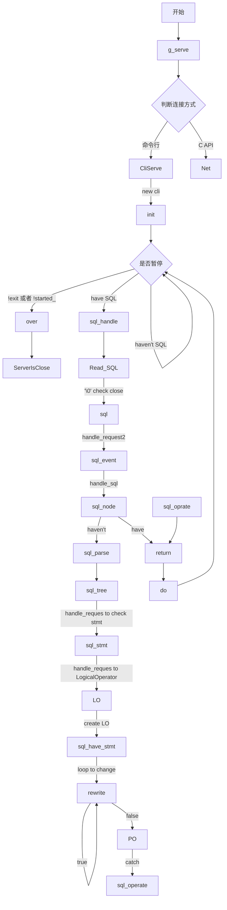

```mermaid
graph TD
  main[开始] --> g_serve
  g_serve --> serve{判断连接方式}
  serve -->|命令行| cli[CliServe]
  cli --> |new cli| init
  init --> while{是否暂停}
  while --> |have SQL| sql_handle
  while --> |haven't SQL| while
  while --> |!exit 或者 !started_ | over
  over --> ServerIsClose
  sql_handle --> Read_SQL
  Read_SQL --> |'\0' check close| sql
  sql -->  |handle_request2| sql_event
  sql_event --> |handle_sql| sql_node
  sql_node --> |have| return
  sql_node --> |haven't| sql_parse
  sql_parse --> sql_tree
  sql_tree --> |handle_reques to check stmt| sql_stmt
  sql_stmt --> |handle_reques to LogicalOperator| LO
  LO --> |create LO| sql_have_stmt
  sql_have_stmt --> |loop to change| rewrite
  rewrite --> |true| rewrite
  rewrite --> |false| PO
  PO --> |catch| sql_operate
  sql_oprate -->return
  return --> do
  do -->while
  serve --> |C API| Net
```